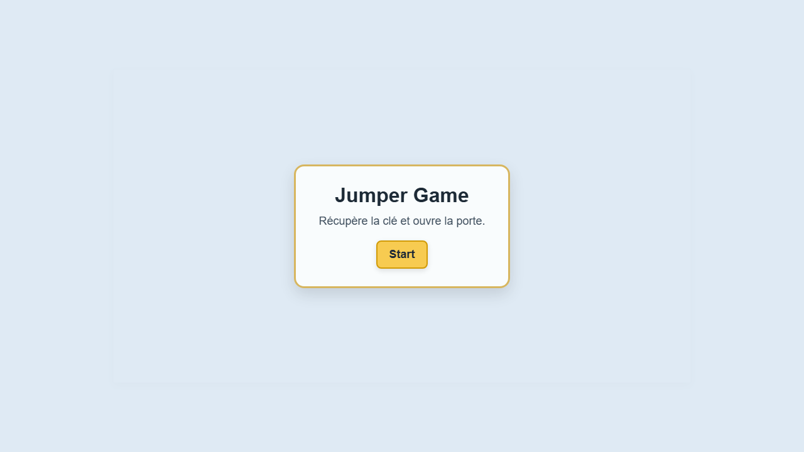

# Jumper Game

A small browser platform game where the player must move through several levels, collect the key, and reach the door to complete each stage.

## Overview

Jumper Game is a simple 2D platformer built with JavaScript and Phaser. The goal is to explore the level, jump across platforms, find the hidden key, and unlock the exit door. The game includes multiple levels, a start menu, a restart option, and a win screen.

## Gameplay

- Move left and right
- Jump over platforms
- Collect the key
- Reach the door to unlock the next level
- Complete all levels to win the game

## Features

- 3 levels
- keyboard controls with movement and jumping
- collectible key mechanic
- door unlock system
- replay and restart flow
- polished menu and end screen
- sound effects and simple animation

## Controls

- A / D or Left / Right: move
- W or Up Arrow: jump

## Screenshots

### Start menu


### Gameplay



## Tech Stack

- HTML
- CSS
- JavaScript
- Phaser
- Vite

## Run locally

```bash
npm install
npm run dev
```

## Build for production

```bash
npm run build
```

## Project status

This project is a lightweight browser game made for learning, experimentation, and deployment as a simple playable web experience.
